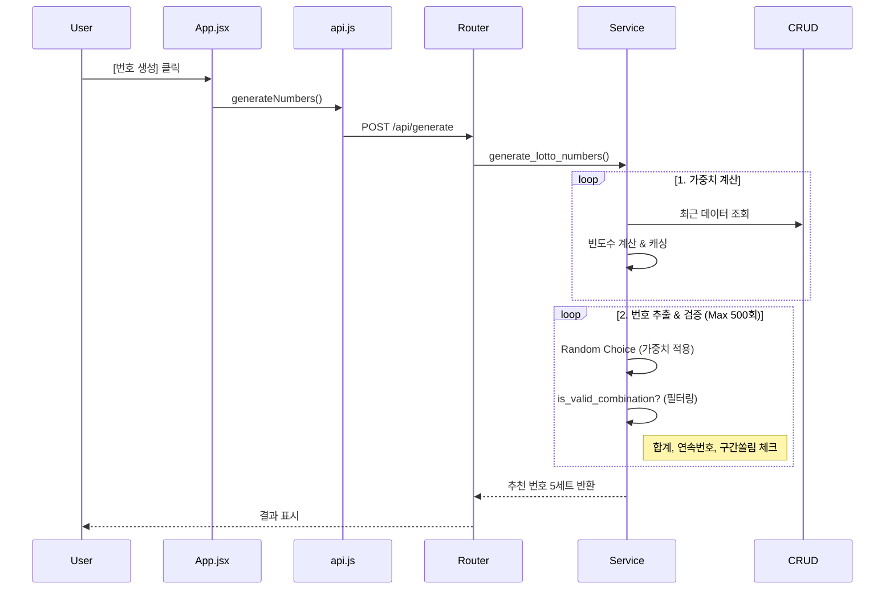

# 🛠️ Lotto Genius 개발자 심층 가이드

본 문서는 Lotto Genius의 유지보수와 기능 확장을 목표로 하는 개발자를 위한 상세 분석 문서입니다. 단순한 코드 설명이 아니라, **기능이 실행되는 흐름**을 따라가며 구조를 파악할 수 있도록 작성되었습니다.

---

## 1. 아키텍처 조감도 (The Big Picture)

이 프로젝트는 철저한 **Layered Architecture (계층형 아키텍처)**를 따릅니다. 각 계층은 자신의 역할에만 집중하며, 서로의 영역을 침범하지 않습니다.

```mermaid
graph TD
    User[사용자 (Browser)] -->|HTTP Request| Router[API Router (Controller)]
    Router -->|Validate| Schema[Pydantic Schema (DTO)]
    Router -->|Call Logic| Service[Service Layer (Business Logic)]
    Service -->|Query/Save| CRUD[CRUD Layer (Repository)]
    CRUD -->|SQL| DB[(SQLite / PostgreSQL)]
    Service -->|Constants| Config[core/constants.py]
```

### 📂 파일 구조와 역할 매핑
*   **Router (`api/v1/routers/lotto.py`):** "주문 접수처". 요청을 받고, 적절한 서비스에게 일을 시키고, 결과를 응답합니다.
*   **Service (`services/lotto_service.py`):** "주방장". 핵심 요리(알고리즘 계산, 필터링, 통계 분석)를 수행합니다.
*   **CRUD (`crud/lotto_crud.py`):** "창고지기". 재료(데이터)를 DB에서 꺼내오거나 넣습니다.
*   **Config (`core/constants.py`):** "레시피". 요리에 필요한 정량(필터링 기준값)을 정의합니다.

---

## 2. 유스케이스별 코드 추적 (Code Trace)

### 🟢 UC-01: 앱 초기 구동 및 데이터 로딩
사용자가 앱을 처음 켰을 때 일어나는 일입니다.

**Flow:**
1.  `Frontend`: `App.jsx` 마운트(`useEffect`) -> `lottoService.getLatestRound()` 호출.
2.  `Backend`: `main.py` 서버 시작 -> `startup_event` 발생 -> `migration_service.migrate_if_empty()` 실행 (DB 비었으면 엑셀 로딩).
3.  `API`: `GET /api/latest-round` 요청 -> DB에서 최신 회차 조회 -> 응답.

**소스 위치:**
*   Frontend 진입: `frontend/src/App.jsx` (L.45 `useEffect`)
*   API 호출: `frontend/src/services/api.js` (L.13 `getLatestRound`)
*   DB 초기화: `backend/services/migration_service.py` (L.15 `migrate_if_empty`)

---

### 🔵 UC-02: 번호 생성 (핵심 알고리즘)
사용자가 [번호 생성] 버튼을 눌렀을 때의 흐름입니다. 가장 복잡하고 중요한 로직입니다.

**Flow Diagram:**


**소스 위치 & 수정 포인트:**
*   **알고리즘 수정:** `backend/services/lotto_service.py` (L.80 `generate_lotto_numbers`)
*   **필터링 조건 변경:** `backend/services/lotto_service.py` (L.48 `is_valid_combination`)
*   **임계값(기준) 변경:** `backend/core/constants.py` (예: 연속 번호 허용 개수 등)

---

### 🟠 UC-03: 통계 차트 조회
사용자가 [통계 분석] 탭을 눌렀을 때의 흐름입니다.

**Flow:**
1.  `Frontend`: 탭 전환 -> `fetchStats()` 실행.
2.  `Backend`: `GET /api/stats` -> `lotto_service.get_lotto_stats()` -> 캐시 확인.
3.  `Calculation`: 캐시 없으면 DB 조회 -> 최다/최소 빈도 계산 -> 구간 분포 계산 -> 메모리에 캐싱.
4.  `Response`: JSON 데이터 반환 -> `Recharts` 라이브러리가 그래프 렌더링.

**소스 위치:**
*   **통계 계산 로직:** `backend/services/lotto_service.py` (L.120 `get_lotto_stats`)
*   **차트 UI 수정:** `frontend/src/components/StatsDashboard.jsx`

---

### 🔴 UC-04: 데이터 수동 업데이트
매주 토요일, 관리자가 새 당첨 번호를 입력할 때입니다.

**Flow:**
1.  `Frontend`: `App.jsx` -> `[+]` 버튼 -> 모달 입력 -> `lottoService.addRound()`.
2.  `Backend`: `POST /api/add-round` -> `lotto_crud.create_lotto_round()`.
3.  `DB`: `INSERT INTO lotto_rounds ...` 수행.
4.  `Cache`: **중요!** 데이터가 변했으므로 `_CACHE` 변수 초기화됨 (다음 요청 때 새로 계산).

**소스 위치:**
*   **입력 폼:** `frontend/src/App.jsx` (L.130 모달 영역)
*   **저장 로직:** `backend/crud/lotto_crud.py` (L.15 `create_lotto_round`)

---

## 3. 핵심 기능 작동 원리 및 제어

### ⚡ 1. 스마트 필터링 (Smart Filtering)
단순 랜덤이 아닌 **"그럴듯한 번호"**를 만드는 핵심입니다.
*   **원리:** 무작위로 6개를 뽑은 뒤, `constants.py`에 정의된 4가지 조건(합계, 홀짝, 연속, 구간)을 통과하는지 검사합니다. 통과 못하면 버리고 다시 뽑습니다.
*   **제어:** 너무 깐깐하게 설정하면 500번을 시도해도 번호를 못 찾을 수 있습니다. 이때는 `backend/core/constants.py`의 `MAX_RETRIES`를 늘리거나 조건을 완화해야 합니다.

### 🚀 2. 인메모리 캐싱 (In-Memory Caching)
속도를 위해 매번 DB를 긁지 않고 계산 결과를 메모리(`_CACHE` 딕셔너리)에 저장합니다.
*   **원리:** 요청이 오면 `DB의 최신 회차` vs `캐시된 회차`를 비교합니다.
    *   같으면 -> 저장된 계산 결과 리턴 (0.001초).
    *   다르면(새 데이터 추가됨) -> 다시 계산하고 캐시 업데이트.
*   **제어:** `backend/services/lotto_service.py`의 `_CACHE` 변수.

### 📸 3. 이미지 저장 (Image Export)
*   **원리:** `html2canvas` 라이브러리가 HTML DOM 요소를 읽어서 Canvas(그림)로 그린 뒤, 이를 PNG 파일로 변환하여 브라우저 다운로드를 트리거합니다.
*   **제어:** `frontend/src/components/GameList.jsx`의 `handleSaveImage` 함수.

---

## 4. 유지보수 가이드 (Where to Edit?)

**Q. "번호가 너무 짝수에만 몰려요."**
👉 `backend/core/constants.py`에서 `ODD_EVEN_RATIO_EXCLUDE`를 확인하고, 로직을 `lotto_service.py`에서 수정하세요.

**Q. "차트 색상을 바꾸고 싶어요."**
👉 `frontend/src/components/StatsDashboard.jsx`의 `COLORS` 배열을 수정하세요.

**Q. "새로운 통계(예: 끝수 분석)를 추가하고 싶어요."**
1.  `backend/schemas/lotto.py`: `StatsResponse`에 새 필드 추가.
2.  `backend/services/lotto_service.py`: `get_lotto_stats` 함수에 계산 로직 추가.
3.  `frontend/src/components/StatsDashboard.jsx`: 새 차트 컴포넌트 추가.

이 가이드를 따라가면, 어떤 기능이든 두렵지 않게 수정하고 확장할 수 있습니다.
**당신의 코드를 지배하세요!** 👨‍💻
